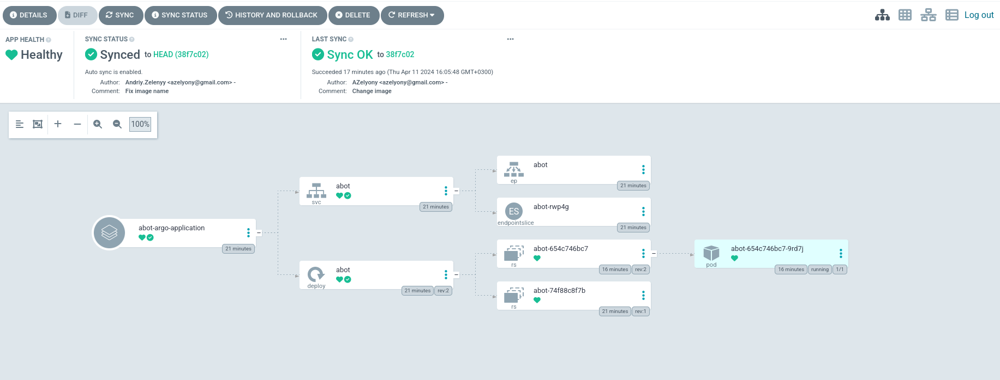

# DEMO 
## Використовуємо ArgoCD для відстеження змін у коді на GitHub

## Screenshot admin panel ArgoCD

Тож маємо вісновок, що Argocd чудово реагує на зміни у Git та доволі швидко корегує отчення.